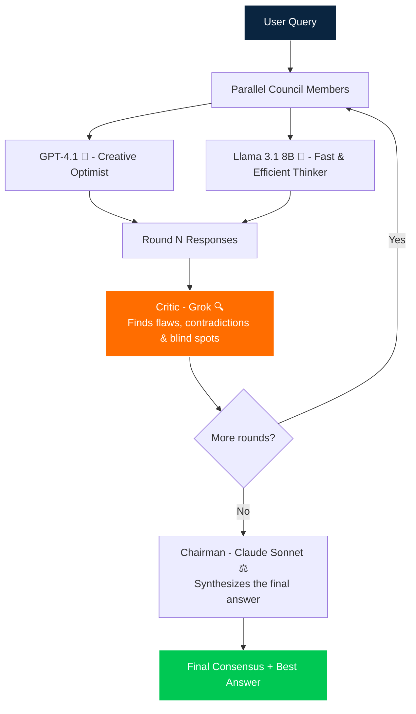

# 🧠 CouncilAI - Multi-LLM Debate System

**An AI Council where multiple frontier models discuss, debate, and deliver the best possible answer.**

🔗 Live App

[Launch CouncilAI on Streamlit Cloud](https://councilai-io.streamlit.app/)


## ✨ What is CouncilAI?

Instead of asking a single LLM, CouncilAI lets **multiple AI models** debate across rounds:
- Council members (GPT-4.1, Llama 3.1) respond in parallel with different personas
- After every round, **Grok** acts as a ruthless Critic — finding flaws, contradictions, and blind spots
- A **Claude Sonnet Chairman** synthesizes the strongest final consensus

This approach significantly reduces hallucinations and produces more balanced, high-quality outputs.

## 🎥 Demo Video
[Watch the demo](https://www.loom.com/share/3fa9529d01f34033ac04616ce06cf10c)  


## 🚀 Features

- Multi-round debate (1–3 rounds) with customizable personas per model
- Parallel model calls for speed via `asyncio.gather`
- **Dedicated Critic (Grok)** fires after every round — not just at the end
- **Chairman synthesis (Claude Sonnet 4.6)** delivers the final balanced answer
- Live Chat view (WhatsApp-style) showing debate + critic feedback in sequence
- Round-wise expandable view for deep inspection
- Cost-optimized (uses cheap & fast models via OpenRouter; Llama is free tier)
- Clean, interactive Streamlit UI

## 🛠️ Tech Stack

- **Frontend**: Streamlit
- **LLM Orchestration**: LiteLLM (one key for 100+ models via OpenRouter)
- **Graph Engine**: LangGraph (state machine for debate → critic → chairman flow)
- **Backend**: Async Python
- **Deployment**: Streamlit Community Cloud

## 📸 Screenshots / GIFs

*(Add 2-3 screenshots or GIFs here showing:)*
- Sidebar with model selection
- Debate in progress (Live Chat view)
- Final Chairman synthesis

## 🏗️ Architecture



## ⚙️ Council Roles

| Role | Model | Persona |
|---|---|---|
| 🚀 **Debater** | GPT-4.1 | Creative optimist |
| 🌟 **Debater** | Meta Llama 3.1 8B | Fast & efficient thinker |
| 🔍 **Critic** | Grok 4.1 Fast | Ruthless fault-finder (after every round) |
| ⚖️ **Chairman** | Claude Sonnet 4.6 | Impartial synthesizer |

> Debaters are configurable from the sidebar. Grok is always the Critic; Claude Sonnet is the recommended Chairman.

## 🚀 Getting Started

### 1. Clone the repo

```bash
git clone https://github.com/saibhargav29-git/councilai.git
cd councilai
```

### 2. Install dependencies

```bash
pip install -r requirements.txt
```

### 3. Run the app

```bash
streamlit run app.py
```

### 4. Add your OpenRouter API key

Paste your `sk-or-v1-...` key in the sidebar when the app opens.

> Get a free key at [openrouter.ai](https://openrouter.ai)

## 🛠️ Extending CouncilAI

- **Add debaters** — any OpenRouter model works; add to `ALL_AVAILABLE_MODELS` in `app.py`
- **Swap the Critic** — change `critic_model` in `critic_node()` inside `council_graph.py`
- **Swap the Chairman** — select any model from the sidebar dropdown
- **More rounds** — slider supports 1–3 rounds out of the box
